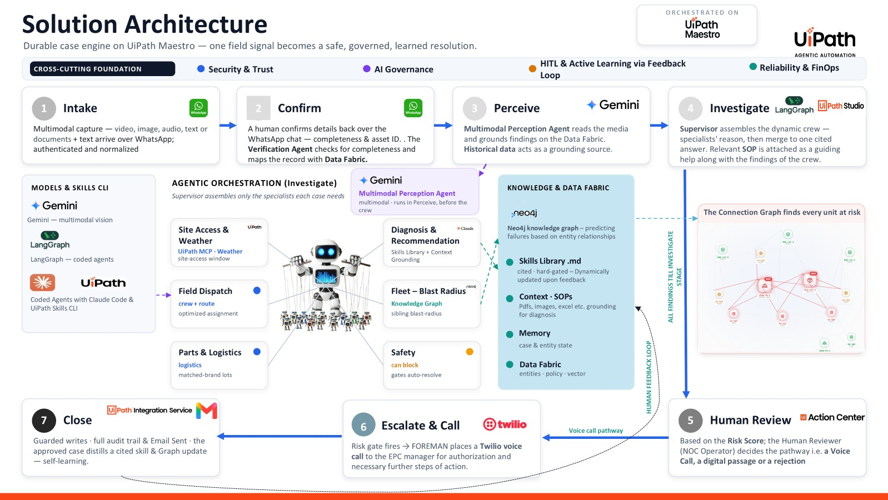

# FOREMAN — Agentic Orchestration for Frontline & Field Operations

> **UiPath AgentHack 2026 · Track 1 — UiPath Maestro Case**
> An autonomous operations colleague that turns a single frontline observation — a photo, a video, a voice note, a message — into an **investigated, approved, executed, and fully auditable** outcome. One field signal becomes a safe, governed, *learned* resolution, orchestrated end-to-end on a UiPath **Maestro Case**.

> **One closed loop — Sense → Reason → Decide → Act → Learn.** FOREMAN transforms tribal knowledge into organizational intelligence, so operations get faster, smarter, and continuously improving-.

**🔗 Links** · **Demo video:** [Youtube](https://youtu.be/GLPB2A1sPnw) **Pitch deck:** [Presentation](https://docs.google.com/presentation/d/1CBKZXUenHTAcgkzF4MA7leRiuWBN0DVL/edit?slide=id.p1#slide=id.p1)

**License:** Apache-2.0 · **Built with:** UiPath Maestro, Coded Agents, Action Center, Data Fabric, Context Grounding, Agent Memory, Integration Service, UiPath MCP + Python/LangGraph, Neo4j, Twilio, Gemini, React · **Coding agent:** Claude Code + UiPath Skills CLI (see [Built with a Coding Agent](#built-with-a-coding-agent))

---

## Security note (read before running)

This repository is **scrubbed of credentials**. No `.env`, OAuth token, or API key is committed. To run it you must supply your own secrets via the `.env.example` templates (see [Setup](#setup--installation)). Never commit a real `.env` or a `.uipath/.auth.json` file.

---

## Project Description

**The problem — frontline operations still depend on human expertise.** Across industries, when something fails in the field, the person on site is rarely the expert who can diagnose it. Critical operational knowledge is trapped in a few veterans rather than being accessible, reusable, and scalable across the organization. Concretely:

- **Solved from scratch, every time.** Diagnoses live in a few veterans' heads — unavailable, unscalable, and never compounding.
- **Escalation is slow & unstructured.** Phone tag, lost context, and no audit trail mean hours of downtime before the right person acts.
- **No memory, no foresight.** The same failures recur across the estate, and nobody connects the dots until they become widespread.
- **Knowledge is fragmented.** Information is scattered across systems, documents, emails, chats, and tickets — delaying root-cause analysis.

Why it matters: increased downtime, higher operational cost, compliance & audit risk, and repeated failures. **The gap isn't automation — it's operational intelligence.**

**Who it's for (horizontal).** FOREMAN is industry-agnostic frontline tooling. End users include field technicians & engineers, site supervisors, operations & maintenance teams, field-service personnel, and operations managers — across **Manufacturing, Telecom, Energy & Utilities, Renewable Energy (wind/solar), Cold Chain & Logistics, and Retail & Field Services**.

**The solution.** FOREMAN is an autonomous operations colleague that transforms frontline observations into investigated, approved, executed, and fully auditable outcomes, in **one closed loop**:

1. **Sense** — a signal arrives on any channel (video, image, audio, text, or documents — WhatsApp, Teams, Slack, email, web, IoT). A completeness check runs and the record is mapped to Data Fabric.
2. **Reason** — a Multimodal Perception Agent plus a *dynamic specialist crew* produce a cited root cause, a risk score, and the estate-wide impact. Specialized agents, API workflows, and RPA bots — wired to **MCP connectors**, a **knowledge graph**, **Data Fabric**, and a **skills library** — are orchestrated by a supervisor on demand.
3. **Decide** — a **two-stage gated human-in-the-loop**: first at the channel level (WhatsApp confirmation), then in **UiPath Action Center**, where policy routes the decision to the right human — a digital approval or a phone escalation.
4. **Act** — on approval, the downstream action is performed, including an **outbound Twilio voice call** to the responsible official.
5. **Learn** — an audit pack is issued, stakeholders are emailed, and the outcome is written back through a **feedback loop** to the knowledge graph and the skills library.

**What makes FOREMAN unique.** It **learns from every incident** (a human feedback loop captures resolutions as reusable knowledge), **connects enterprise knowledge** (a knowledge graph + semantic layer + skills library + Data Fabric surface root causes and hidden dependencies), **understands any signal** (voice, image, video, documents), and delivers **governed autonomous resolution** (it orchestrates actions, approvals, escalations, and audit trails with human oversight).

**Proposed ROI** (from the solution model): 60–80% faster resolution, 30–50% lower operational cost, ~40% fewer repeat failures, and 100% auditable decisions.

---

## Solution Architecture

A durable case engine on **UiPath Maestro** — one field signal becomes a safe, governed, learned resolution.



**The case pipeline (7 stages on Maestro):**

1. **Intake** — multimodal capture: video, image, audio, text, or documents arrive over WhatsApp; the message is authenticated and normalized. *(Entry path: a Twilio Function `whatsapp-in` POSTs each message as JSON to the **Foreman-Dispatcher** HTTP Webhook, which starts the case.)*
2. **Confirm** — a human confirms details back over the WhatsApp chat; a Verification Agent checks completeness & asset ID and maps the record to **Data Fabric**.
3. **Perceive** — the **Multimodal Perception Agent** (Gemini) reads the media and grounds its findings on Data Fabric, with historical issue data as a grounding source.
4. **Investigate** — the **Supervisor** assembles a *dynamic crew* — only the specialists each case needs — who reason in parallel and merge into one cited answer, with the relevant SOP attached.
5. **Human Review** — based on the **risk score**, the human reviewer (NOC operator) chooses the pathway in **Action Center**: a voice call, a digital approval, or a rejection.
6. **Escalate & Call** — if the risk gate fires, FOREMAN places a **Twilio voice call** to the EPC/site manager for spoken authorization.
7. **Close** — guarded writes, a full audit trail, and a stakeholder email; the approved case distills a **cited skill** and updates the knowledge **graph** — self-learning.

**The dynamic crew (assembled by the Supervisor during Investigate):** Multimodal Perception · Site Access & Weather (**UiPath MCP · Weather**) · Diagnosis & Recommendation (Skills Library + Context Grounding) · Field Dispatch (crew + route) · Fleet — Blast Radius (**Neo4j** knowledge graph) · Parts & Logistics · Safety (can block; gates auto-resolve).

**Knowledge & Data Fabric (the stores the agents read/write):** **Neo4j** knowledge graph (predicts at-risk siblings from entity relationships) · **Skills Library** (`.md`, cited, hard-gated, updated on feedback) · **Context / SOPs** (PDFs, images, sheets — grounding for diagnosis) · **Agent Memory** (case & entity state) · **Data Fabric** (entities · policy · vector).

**Models & build:** Gemini (multimodal vision) · LangGraph (coded agents) · **Coded agents built with Claude Code + the UiPath Skills CLI**.

**Cross-cutting foundation:** Security & Trust · AI Governance · HITL & Active Learning via the Feedback Loop · Reliability & FinOps.

> A live **control room UI** (in [`UI/`](#the-control-room-ui)) renders the whole case as it happens — every stage, agent, risk score, fleet-graph hit, and the voice call — by subscribing to the same event stream the agents emit.

---

## UiPath Components

| Component | How FOREMAN uses it | Where in repo |
|---|---|---|
| **Foreman-Dispatcher (RPA + HTTP Webhook trigger)** | **Entry point.** Receives the inbound WhatsApp webhook from Twilio, deserializes the JSON payload, and triggers the Maestro case | `solutions/foremen v1/unpacked/Foreman-Dispatcher` |
| **Maestro (Agentic Case)** | The multi-stage case that orchestrates the whole flow, started by the Dispatcher's webhook trigger | `solutions/foremen v1/unpacked/Agentic case` |
| **Agents (coded)** | 15 Python/LangGraph agents packaged & published as UiPath Agents. 5 run as case tasks (intake, vision, supervisor, voice, email); the supervisor invokes the other 10 at runtime | `agents/*` |
| **Action Center** | Human safety-review approval app (approve/reject with risk band + action plan) | `solutions/foremen v1/unpacked/SimpleApprovalApp` |
| **RPA / API workflows** | Dispatcher (webhook), WhatsApp send/receive, wait-for-reply, download & save media, log conversation, write perception, resolve keys, reset conversation | `solutions/foremen v1/unpacked/*`, `solutions/solution 4/unpacked/*` |
| **Data Fabric** | Entity store for Asset, Site, Vendor, Warranty, ServiceContract, Crew, Inventory, PartLot, AssetIssueHistory | `data-fabric/` |
| **Context Grounding** | Indexed **skill cards** (`SK-*.md`) + equipment **spec/safety PDFs** that ground diagnosis | `context-grounding/` |
| **MCP Server (weather)** | A UiPath-hosted **MCP server** (AgentHub) exposing a weather tool; the `foreman-weather` agent calls it (via `WEATHER_MCP_URL`) to add weather context to a case | hosted in UiPath (AgentHub); consumed by `agents/foreman-weather` |
| **Agent Memory** | Per-asset issue history & carried-forward case context | written by agents at runtime |
| **Twilio Function `whatsapp-in`** | Serverless inbound bridge: catches each WhatsApp message and POSTs it as JSON to the Dispatcher's webhook URL (`UIPATH_WEBHOOK_URL`) | `integrations/twilio/whatsapp-in.js` |
| **Integration Service / Connectors** | HTTP Webhook trigger, Gmail, Storage Bucket | configured inside the solutions |

---

## Agent Type

**Both** agent types, deliberately combined:

- **Coded agents** — the 15 agents under `agents/` are authored in **Python + LangGraph** (entry `main.py:graph`), each with its own `pyproject.toml`, `langgraph.json`, and `uipath.json`, packaged with the UiPath CLI.
- **Low-code agents / orchestration** — the **Maestro case**, the **Action Center** approval app, and the **RPA/API workflows** are built in **UiPath Studio Web** and shipped as solution archives (`.uis`).

The coded agents do the reasoning; the low-code layer does the orchestration, human approval, and system integration. The Maestro case binds them together.

### The 15 coded agents

| Agent | Role |
|---|---|
| `foreman-intake` | Parse inbound WhatsApp event; gather media + issue + validated asset; reply until complete |
| `foreman-vision` | Gemini vision: structured fault perception from photo/video; reconcile with history |
| `foreman-supervisor-v1` | Orchestrating brain: diagnosis, risk score, action plan, SOP report, sub-agent fan-out |
| `foreman-diagnosis-recommendation` | Root-cause + recommended fix from perception + history |
| `foreman-safety` | Safety gating / risk-band logic |
| `foreman-fleet-blast-radius` | Neo4j knowledge-graph query: how far the fault could spread across the fleet |
| `foreman-entitlement` | Warranty / service-contract entitlement check |
| `foreman-parts` | Parts / inventory / part-lot lookup |
| `foreman-vendor` | Vendor lookup & routing |
| `foreman-cost` | Cost / SLA-exposure estimation |
| `foreman-telemetry` | Telemetry / sensor-context enrichment |
| `foreman-weather` | Weather context via a UiPath-hosted MCP endpoint |
| `foreman-field-dispatch` | Crew dispatch + maps/routing (`maps.py`) |
| `foreman-email` | Compose & send the SOP/report email with attachments (Gmail) |
| `foreman-voice` | Two-way Twilio voice call for spoken approval (+ `voice_server.py` webhook) |

---

## The Control Room UI

`UI/` is a real-time **operations control room** (React + TypeScript + Vite + Tailwind + Zustand) that renders the case **live** as it moves through every stage — the WhatsApp thread, the stage rail, each agent in the crew "thinking," the risk meter, the Neo4j fleet-blast-radius graph, the voice call, and the closing audit + learned skill.

It works off a single normalized **`CaseEvent`** contract, so the same UI renders:

```
UiPath Maestro Case                     your infra                    browser
  coded agents  ──emit CaseEvent──▶  view-backend (FastAPI)  ──WebSocket──▶  React UI
  (foreman_emit.py SDK)              POST /ingest/{case}                     (Zustand store)
                                     holds snapshot + fans out /ws          live tabs update
```

- **Agent side** — each LangGraph node imports the `foreman_emit.py` SDK and calls `emit(case_id, event)` at entry/exit (stage entered, agent running/completed, perception ready, risk scored, fleet ready, task raised, call line, skill written, closed…).
- **View-backend** (`UI/server/view_backend.py`) — receives events at `POST /ingest/{case_id}` (authenticated with `FOREMAN_INGEST_SECRET`), keeps a per-case snapshot for late clients, and fans every event out over a `/ws` WebSocket. It also accepts Orchestrator and Action Center webhooks and translates them to `CaseEvent`s.

See `UI/INTEGRATION.md` for the full event map, and [How to run the UI](#how-to-run-the-control-room-ui) below.

---

## Repository Structure

```
foremen-uipath/
├── LICENSE                          # Apache-2.0
├── README.md                        # this file
├── .gitignore                       # keeps secrets / build-junk out of git
│
├── agents/                          # 15 coded agents (Python + LangGraph)
│   ├── agents.env.example           # shared secrets template (rename to .env.example; copy to agents/.env)
│   └── foreman-<name>/              # the 15: -cost, -diagnosis-recommendation, -email, -entitlement,
│       │                            #   -field-dispatch, -fleet-blast-radius, -intake, -parts, -safety,
│       │                            #   -supervisor-v1, -telemetry, -vendor, -vision, -voice, -weather
│       ├── main.py                  # entry point: main.py:graph
│       ├── langgraph.json           # graph registration
│       ├── uipath.json              # UiPath packaging config
│       ├── pyproject.toml           # deps (uv); requires-python >=3.11
│       ├── uv.lock                  # pinned dependency lock
│       ├── input.json               # sample input for `uipath run` (every agent has one)
│       ├── entry-points.json
│       ├── bindings.json
│       ├── agent.mermaid            # the agent's own graph, as a mermaid diagram
│       ├── project.uiproj           # UiPath project file
│       └── CLAUDE.md                # coding-agent instructions
│       #  some agents also add: foreman_emit.py, foreman_events.py, voice_server.py, maps.py,
│       #  kg.py / kg_check.py / kg_sync_foreman.py, p.py, test_intake.py, EMAIL_AGENT.md,
│       #  input_send.json, input.empty.json, input.partial.json
│
├── solutions/                       # UiPath Studio Web solution archives (.uis) + readable unpacked sources
│   ├── foremen v1/
│   │   ├── foremen v1.uis            # importable solution (the Maestro case + workflows + app)
│   │   └── unpacked/                 # readable: Foreman-Dispatcher (webhook entry point), Agentic case,
│   │                                 #   SimpleApprovalApp, WaitForReply, WritePerception, LogConversation,
│   │                                 #   ResolveKeys, resources
│   └── solution 4/
│       ├── Solution 4.uis            # importable solution (WhatsApp RPA/API workflows)
│       └── unpacked/                 # readable: RPA Workflow, SendWhatsApp, sendwhatsappmedia, ResetConversation
│
├── data-fabric/                     # Data Fabric seed + schema
│   ├── Schema.json                  # entity schema (import first)
│   ├── Asset.csv  Site.csv  Vendor.csv  Warranty.csv  ServiceContract.csv
│   ├── Crew.csv  Inventory.csv  PartLot.csv  AssetIssueHistory.csv
│   └── README.md                    # import order + caveats
│
├── context-grounding/               # what the agents are grounded on
│   ├── SK-*.md                      # 18 skill cards (one per fault archetype)
│   └── *.pdf                         # 6 equipment spec / safety bulletins
│
├── neo4j/
│   └── kg_sync_foreman.py           # sync Data Fabric -> Neo4j graph (for blast-radius)
│
├── integrations/
│   ├── voice_server.py              # FastAPI webhook for the two-way voice call
│   ├── integrations.env.example     # voice-server secrets template (rename to .env.example)
│   └── twilio/
│       └── whatsapp-in.js           # Twilio Function: inbound WhatsApp -> UiPath webhook bridge
│
├── UI/                              # real-time control room (React + TS + Vite + Tailwind)
│   ├── src/
│   │   ├── App.tsx  main.tsx  types.ts  config.ts  index.css  vite-env.d.ts
│   │   ├── components/              # 12 components: StageRail, WhatsAppThread, FleetGraph, RiskMeter,
│   │   │                            #   AgentCard, TaskCard, ArtifactCard, ActivityLog, SkillFileModal, Logo, …
│   │   ├── app/  pages/  store/  lib/  data/   # routes, Zustand store, CaseEvent feed, fixtures
│   │   └── assets/                  # logos, …
│   ├── server/                      # the view-backend
│   │   ├── view_backend.py          # FastAPI: POST /ingest/{case} -> fan out over /ws
│   │   ├── foreman_emit.py          # the emit SDK every coded agent imports
│   │   ├── replay_trace.py          # drive the whole UI from a real Maestro trace (no UiPath needed)
│   │   ├── foreman_vision_agent.py  # inline-emit example agent
│   │   ├── requirements.txt  requirements-deploy.txt
│   ├── INTEGRATION.md               # how agents bind to the UI (the CaseEvent contract)
│   ├── .env.example                 # VITE_FEED_WS_URL
│   ├── render.yaml                  # deploy the backend (Render/Fly/VM)
│   ├── index.html  vite.config.ts  tailwind.config.js  postcss.config.js  tsconfig*.json
│   ├── package.json  package-lock.json
│   └── graphics/  pages/  public/   # design-reference images + static assets
│
└── docs/
    ├── coding-agent/                # Claude Code evidence: 12 per-agent design docs (*.md)
    └── screenshots/                 # 15 screenshots of the running solution
```

> **Note on folder names with spaces** (`foremen v1`, `solution 4`): these work in git, but always quote them in shell commands, e.g. `cd "solutions/foremen v1"`.
>
> **Before pushing, finish these:** rename `agents/agents.env.example` → `agents/.env.example` and `integrations/integrations.env.example` → `integrations/.env.example`; add `UI/server/.env.example`; add `docs/architecture.png` (export slide 7 of the deck); and delete the non-tracked leftovers (`UI/.git`, `UI/server/.env`, `neo4j/.env.txt`).

---

## Setup & Installation

### Prerequisites
- A **UiPath Automation Cloud** tenant with Maestro, Agents, Action Center, Data Fabric, Context Grounding enabled.
- **Python >= 3.11** and **[uv](https://docs.astral.sh/uv/)** (`pip install uv`).
- **UiPath CLI**: `pip install uipath` (provides `uipath auth | run | pack | publish`).
- Accounts/keys: **Twilio** (WhatsApp sandbox + a voice-capable number), **Google Gemini** API key, a **Gmail App Password**, a **Neo4j AuraDB** instance.
- For the voice call: **cloudflared** (or any HTTPS tunnel) to expose `voice_server.py`.

### 1. Clone & configure secrets
```bash
git clone <your-repo-url> foremen-uipath
cd foremen-uipath

# Per-run secrets for the agents, the voice server, and the UI:
cp agents/.env.example       agents/.env          # then fill in
cp integrations/.env.example integrations/.env     # then fill in
cp UI/.env.example           UI/.env               # UI feed URL / mode
cp UI/server/.env.example    UI/server/.env        # view-backend secret (FOREMAN_INGEST_SECRET)
```

### 2. Load Data Fabric
In UiPath, create the entities from `data-fabric/Schema.json`, then import each CSV into its matching entity via **Entity → Data → Import** (use **Chrome or Edge** — CSV import is not supported in Firefox). See `data-fabric/README.md` for column caveats.

### 3. Index Context Grounding
Create a Context Grounding index and add the `context-grounding/SK-*.md` skill cards and the `*.pdf` specs as its sources.

### 4. (Optional) Build the Neo4j graph
With your `NEO4J_*` values set in `agents/.env`:
```bash
python neo4j/kg_sync_foreman.py     # populates the AuraDB graph from Data Fabric (blast-radius)
```

### 5. Import the UiPath solutions
In **Studio Web → Solutions → Import**, upload **`solutions/foremen v1/foremen v1.uis`** and **`solutions/solution 4/Solution 4.uis`**.
(Or via CLI: `uipath solution upload "solutions/foremen v1/foremen v1.uis"`.)
After import, set the solution's **connections** (HTTP Webhook, Gmail, Storage Bucket) and create the **Assets** in the `Shared` folder that mirror your `.env` (Twilio-Account-Sid/Auth-Token/From-Number, Voice-Webhook-Url, Gmail-User/App-Password, Neo4j-*, Gemini-Api-Key, etc.).

### 6. Deploy the agents
Publish each agent to your Orchestrator feed (see [How to run each agent](#how-to-run-each-agent)), then bind them inside the Maestro case.

### 7. Wire up Twilio (inbound + voice)
- **Inbound WhatsApp:** In the Twilio Console → **Functions & Assets**, create a Function from `integrations/twilio/whatsapp-in.js`. Add an Environment Variable `UIPATH_WEBHOOK_URL` set to the Foreman-Dispatcher **HTTP Webhook** URL (Studio → `foremen v1` → Foreman-Dispatcher → HTTP Webhook trigger), then **Deploy All**. Finally, point your WhatsApp sender/sandbox's "when a message comes in" webhook at this Function's URL (`https://whatsapp-in-<id>.twil.io/whatsapp-in`).
- **Voice:** see the `foreman-voice` row in [How to run each agent](#how-to-run-each-agent) (run `voice_server.py`, expose it, set `VOICE_WEBHOOK_URL`).

### 8. (Optional) Launch the control-room UI
Run the view-backend and the UI so the case renders live (full commands in [How to run the control-room UI](#how-to-run-the-control-room-ui)). For UiPath-cloud agents to reach the backend, expose it with `cloudflared tunnel --url http://localhost:8000` and set `UI/.env`'s `VITE_FEED_WS_URL` to `wss://<host>/ws`.


---

## How to run each agent

All 15 agents share the **same structure and the same commands** — only the secrets and a few special steps differ. From the repo root:

```bash
cd "agents/foreman-<name>"        # e.g. agents/foreman-vision

uv sync                            # install deps from pyproject.toml + uv.lock
uipath auth                        # browser login; writes UIPATH_ACCESS_TOKEN + .uipath/.auth.json

# --- run locally against the bundled sample input ---
uv run uipath run agent --file input.json --output-file out.json
cat out.json

# --- package & publish to your Orchestrator feed ---
uv run uipath pack
uv run uipath publish              # (or: echo 0 | uv run uipath publish  to pick feed 0 non-interactively)
```

> `uipath auth` writes a short-lived token. The coded LLM client (`UiPathChat`) reads `UIPATH_ACCESS_TOKEN` from the environment, so re-run `uipath auth` if a run reports an expired/missing token.

### Agent-specific notes

| Agent | Extra setup before `uipath run` |
|---|---|
| `foreman-vision` | Set `GEMINI_API_KEY` in `agents/.env`. |
| `foreman-fleet-blast-radius` | Set `NEO4J_URI/USERNAME/PASSWORD/DATABASE`; run `python neo4j/kg_sync_foreman.py` once to populate the graph. Helpers: `kg.py`, `kg_check.py`. |
| `foreman-email` | Set `GMAIL_USER` + `GMAIL_APP_PASSWORD` (a Google **App Password**, not your login). Alt input: `input_send.json`. See `agents/foreman-email/EMAIL_AGENT.md`. |
| `foreman-voice` | Needs Twilio creds **and** the webhook server. In a second terminal: `uv run python voice_server.py` (FastAPI on **:8090**), then expose it: `cloudflared tunnel --url http://localhost:8090` and put that HTTPS URL in `VOICE_WEBHOOK_URL`. Use a **voice-capable** Twilio number (the WhatsApp sandbox number cannot place voice). Valid TwiML voice/lang: `Polly.Aditi` + `en-IN`. URL-encode the case-id token (a `+`/`:` in it otherwise breaks the webhook). |
| `foreman-weather` | Set `WEATHER_MCP_URL` to your UiPath-hosted weather MCP endpoint. |
| `foreman-entitlement` | Extra sample inputs provided: `input.empty.json`, `input.partial.json`. |
| `foreman-intake` | Has a quick test: `uv run python test_intake.py`. |
| all others (`cost`, `parts`, `vendor`, `telemetry`, `safety`, `diagnosis-recommendation`, `field-dispatch`, `supervisor-v1`) | No extra keys beyond the UiPath login + Data Fabric access. |

---

## How to run the control-room UI

The UI renders entirely off the `CaseEvent` stream, so you can run it three ways. All commands are from the repo root.

**A — See it instantly from a saved trace (no UiPath needed):**
```bash
# 1) view-backend
cd UI/server
pip install -r requirements.txt
FOREMAN_INGEST_SECRET=dev-secret uvicorn view_backend:app --port 8000

# 2) the UI, in live mode (new terminal, from repo root)
cd UI
npm install
cp .env.example .env                 # set VITE_FEED_MODE=live
npm run dev                          # open the printed localhost URL

# 3) replay a real Maestro trace into it (new terminal)
cd UI/server
FOREMAN_BACKEND_URL=http://localhost:8000 FOREMAN_INGEST_SECRET=dev-secret \
  python replay_trace.py <path-to-trace.json>
```
The dashboard fills in across all stages — Intake → Perceive → Investigate (dynamic crew + fleet blast-radius) → Human Review → Escalate & Call → Close.

**B — Fully live against UiPath:** instrument each coded agent with the `foreman_emit.py` SDK (the node→event map is in `UI/server/LIVE_SETUP.md`), set a **real** `FOREMAN_INGEST_SECRET` (matching the UiPath Credential asset and `UI/server/.env`), expose the backend over HTTPS (`cloudflared tunnel --url http://localhost:8000`), and point `UI/.env`'s `VITE_FEED_WS_URL` at `wss://<host>/ws`.

> Build for hosting with `npm run build` (outputs `UI/dist/`). The backend can be deployed via `UI/render.yaml` (Render/Fly/VM).

---

## Built with a Coding Agent

FOREMAN was built end-to-end with **Claude Code** (with the **UiPath Skills CLI**) as the coding agent — authoring and iterating the 15 Python/LangGraph agents, the Neo4j sync, the Twilio voice server, **and the React control-room UI + its FastAPI view-backend** — and debugging the live integrations.

Evidence is in **`docs/coding-agent/`**:
- **12 per-agent design docs** (`foreman-*-agent.md`) written during the build — each records the agent's structure, the non-obvious gotchas hit while shipping, and how they were resolved (e.g. the `foreman-voice` doc captures the Twilio voice/language fix and the webhook-token URL-encoding bug).
- **`docs/screenshots/`** — 15 screenshots of the agents and the Maestro case running.
- The UI's own build notes live in `UI/INTEGRATION.md` and `UI/server/LIVE_SETUP.md`.

*(Raw session transcripts were intentionally omitted from the public repo because they contained printed credentials; the design docs above are the curated, secret-free record.)*

---

## Team & License

Built for **UiPath AgentHack 2026**. Licensed under **Apache-2.0** — see [`LICENSE`](./LICENSE).
